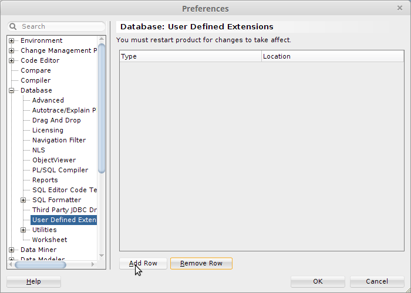
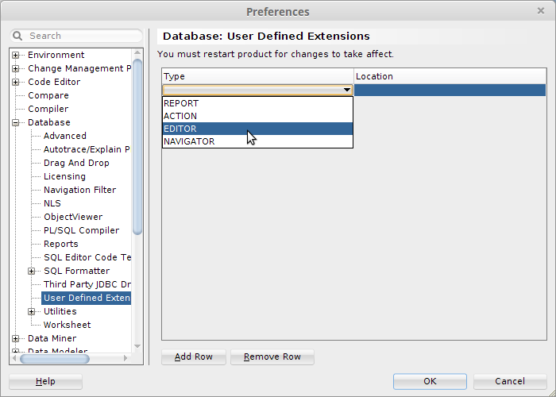
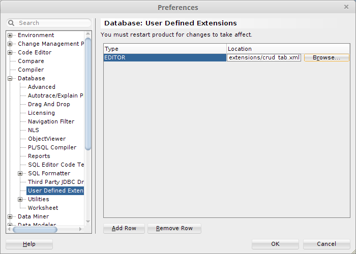
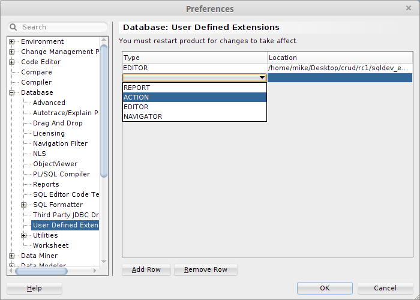
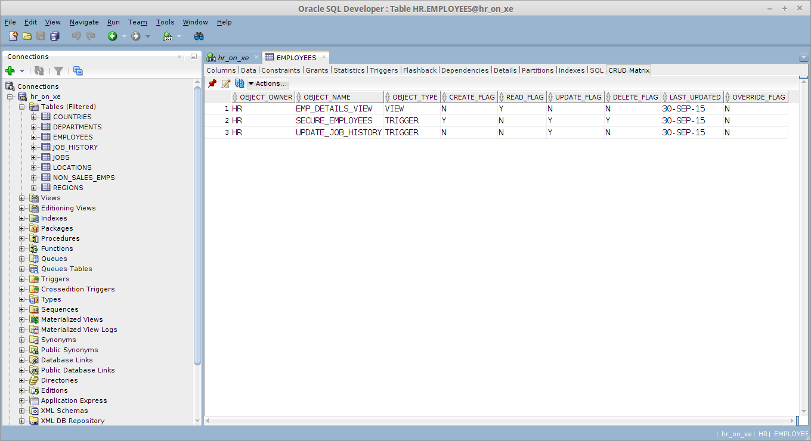
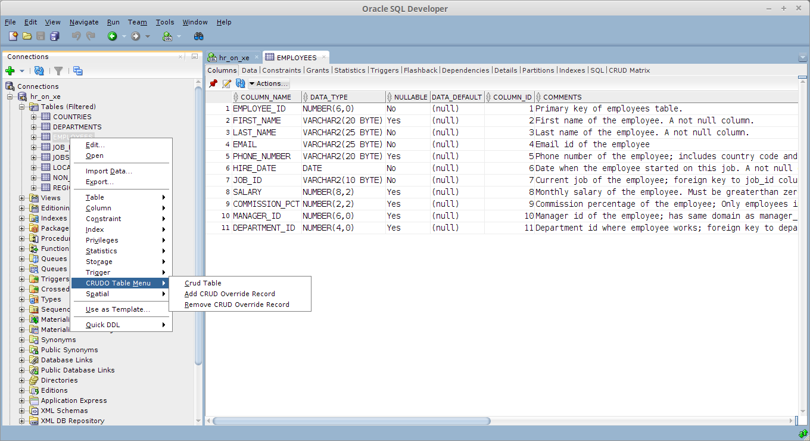

- [Introduction] (#introduction)
- [Pre-Installation] (#pre-installation)
    - [Install Into a New Schema] (#install-into-a-new-schema)
    - [Install into an Existing Schema] (#install-into-an-existing-schema)
- [Installation] (#installation)
- [Post Installation] (#post-installation)
    - [Granting Application Access] (#granting-application-access)
    - [SQLDeveloper Extension Tweaks] (#sqldeveloper-extension-tweaks)
    - [Deploying SQLDeveloper Extensions] (#deploying-sqldeveloper-extensions)
    
#Introduction

Instructions on how to quickly get CRUDO installed and running can be found in [README.md](../README.md).
This page takes you through the full installation process and covers installing into a pre-existing schema rather than creating a new one.
The application does *not* require the SQLDeveloper extensions to be deployed.
If you want to use it without these extensions then this is not a problem. 
If you do, then instructions on how to deploy them are included here.

#Pre-Installation

##Install Into a New Schema

This is the default installation method.
To do this :

    1. open a command prompt in the directory that contains the document you are now reading
    2. connect to the database via SQL*Plus as the user that you want to install into
Then run :
```sql
@scripts\crud_owner.sql
```

You will be prompted for :
    * The name of the new crudo Application Owner (defaults to CRUDO)
    * Default tablespace for the new schema (defaults to USERS)
    * Temporary tablespace for the new schema (defaults to TEMP)
    
**NOTE** - if you select a username other than CRUDO, you will need to make changes to the SQLDeveloper Extensions should you then wish to use them.
Instructions for this are below.

##Install into an Existing Schema
    
If you want to install into an existing schema then you can run the pre_install_check.sql script to make sure that this target schema has the required database privileges

To run the script :

    1. open a command prompt in the directory that contains the document you are now reading
    2. connect to the database via SQL*Plus as the user that you want to install into
Then run :
```sql
@scripts\pre_install_check.sql
```

This script will report any additional grants that are required.

**NOTE** - once again, if you choose this method you will need to make changes to the SQLDeveloper Extensions should you then wish to use them.
Instructions for this are below.

#Installation

Once you have determined the schema to act as the application owner and have completed the Pre-Installation steps, you are ready to proceed with the installation itself.

    1. open a command prompt in the directory that contains the document you are now reading
    2. connect to the database via SQL*Plus as the user that you want to install into
Then run :
```sql
@crudo_deploy.sql
```
Review the output generated in the file **crudo_deploy.log**.

If there are no errors then the installation has been successful.

#Post Installation

##Granting Application Access

To grant access to the application to other database user :

    1. open a command prompt in the directory that contains the document you are now reading
    2. connect to the database via SQL*Plus as the application owner or as a user with the *GRANT ANY* privilege
Then run :
```sql
@scripts/grants.sql
```
You will be prompted to :
    1 - Enter the the Application Owning Schema (defaults to CRUDO)
    2 - Enter the name of the user to grant access to


##SQLDeveloper Extension Tweaks

**NOTE** - If you have installed the application into the CRUDO schema then skip this step.

The SQL and PL/SQL code in the SQLDeveloper extensions is written on the assumption that the application will be installed in the CRUDO schema.
It is also assumed that no synonyms will be created for the database objects that comprise the application.

If you have installed into a schema other than CRUDO then you will need to change the references to the database objects in these extensions to point to the objects in the actual application owner.

Both of the SQLDeveloper extension files are in the *sqldev_extensions* folder

###Altering crud_tab.xml

Open the file *sqldev_extensions/crud_tab.xml* in an editor. and then change line 10, which currently reads :

```sql
   from crudo.crud_matrices
```

replacing *crudo* with the name of the application owning schema.

###Altering crud_table_actions.xml

Open the file *sqldev_extensions/crud_table_actions.xml* in an editor. and then change the following lines, in each case replacing *crudo* with the name of the application owning schema : 

```sql

line 17 - crudo.generate_matrices.crud_table( i_owner => '#OBJECT_OWNER#', i_table_name => '#OBJECT_NAME#', i_refresh_type => '#0#');
line 71 - crudo.generate_matrices.set_override
line 121 - crudo.generate_matrices.remove_override
```

##Deploying SQLDeveloper Extensions

To start with, add the CRUD MATRIX tab.

Open SQLDeveloper, go to the *Tools* menu and select *Preferences*.

Expand the *Database* node and select *User Defined Extensions*



Click the *Add Row* button.

In the new row that's created, click in the *Type* column and select **EDITOR** from the drop-down



In the new row, click in the *Location* column and choose the **crud_tab.xml** file. You can find this file in the sqldev_extensions folder.



Now add the Context Menu.

Click the *Add Row* button.

In the new row that's created, click in the *Type* column and select **ACTION** from the drop-down



In the new row, click in the *Location* column and choose the **crud_table_action.xml** file. You can find this file in the sqldev_extensions folder.

Cick *OK*.

Re-start SQLDeveloper.

You should now see the CRUD MATRIX tab on the Tables view :



If you right-click on a table, you should see the **CRUDO Table Menu** :



